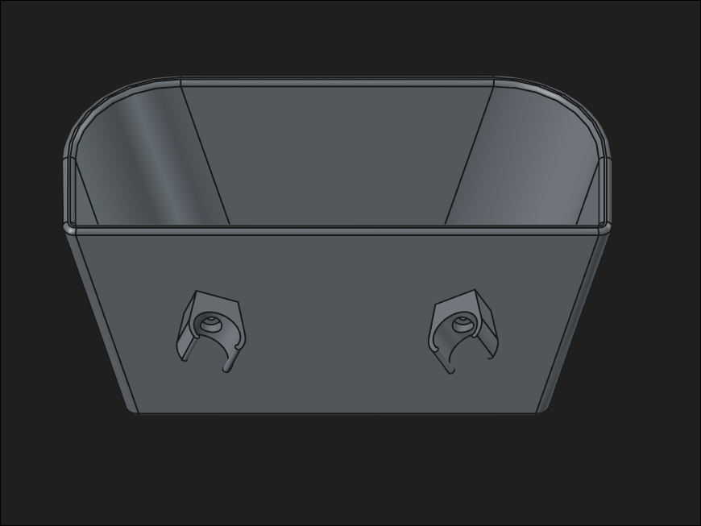
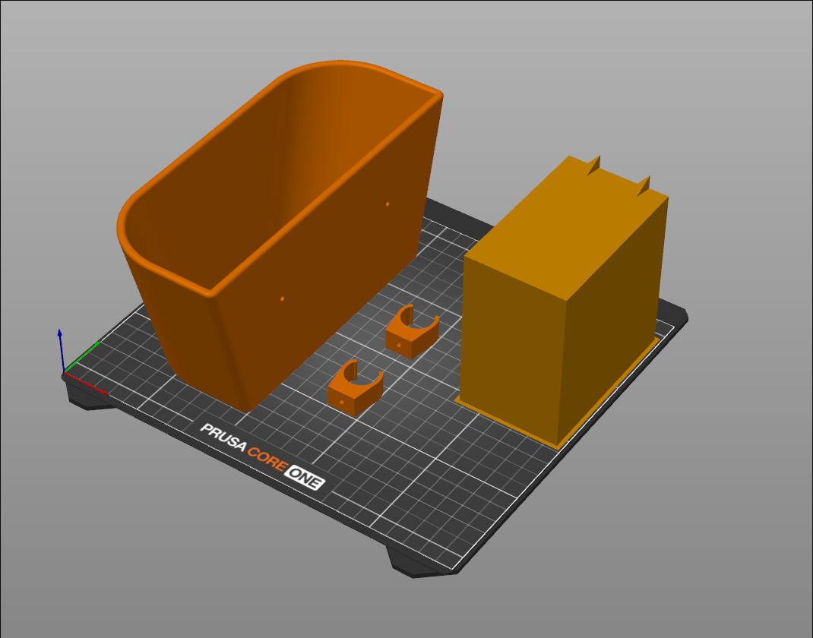
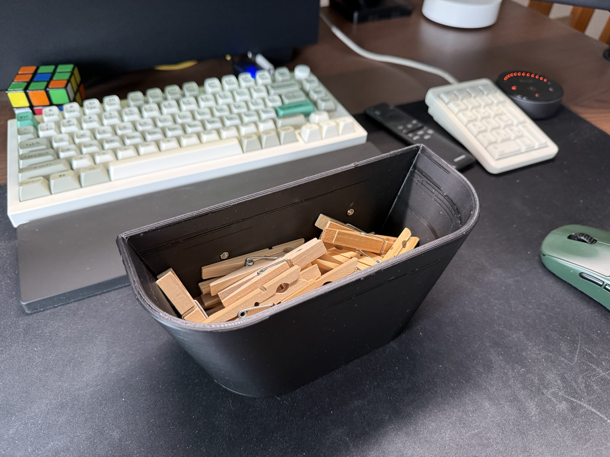
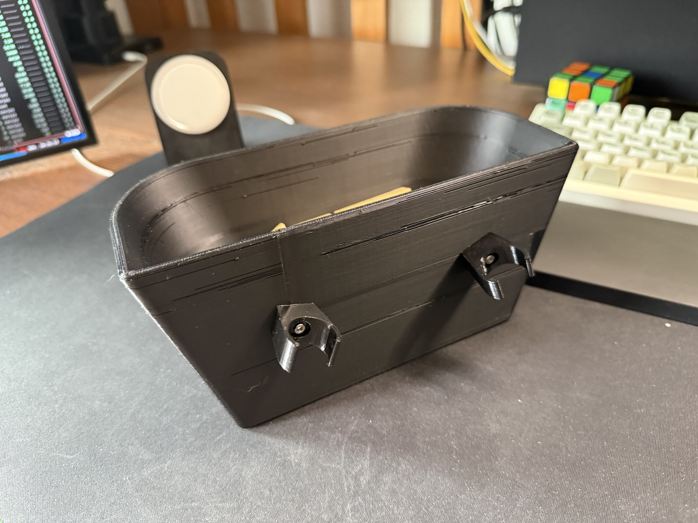
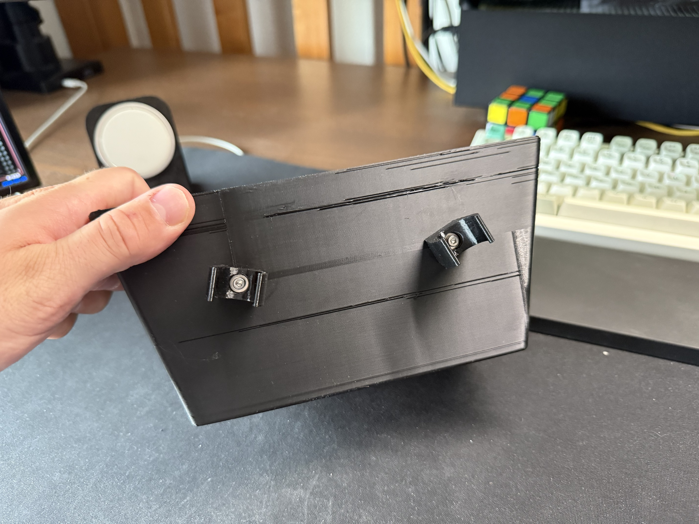
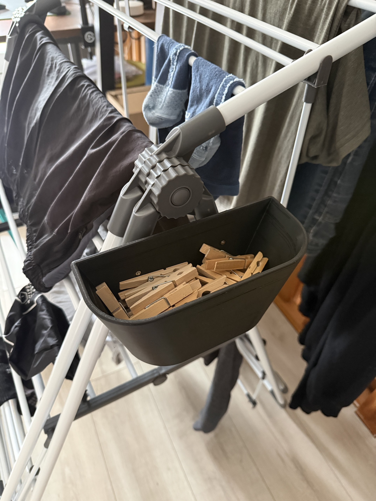

# FreeCAD Clothespin Box

Personal project to design a 3D-printable clothespin box in FreeCAD: an
open basket to hold clothespins, with a pair of spring clips on the back so
it can hang directly on a clothesline.

## Project structure

```
cad/                     # FreeCAD source file (.FCStd)

exports/                 # 3MF exports for slicing and printing
├── clothespin-box.3mf         # full assembly (box + clamps)
├── clothespin-box-Box.3mf     # box body only
└── clothespin-box-Clamp.3mf   # clothesline clip only

images/                  # renders, slicer screenshots and print photos
```

## Design

The box is a rounded, tapered basket with two line clips modeled on its
back face, so the whole thing hangs directly on the clothesline instead of
needing a separate hook or bag.

| | |
|---|---|
|  |  |

## Final print

Printed, filled with clothespins, and validated hanging directly on the
clothesline.

| | |
|---|---|
|  |  |
|  |  |

## Status

v1.0.0 — first working print, fitted and validated on the drying rack.
